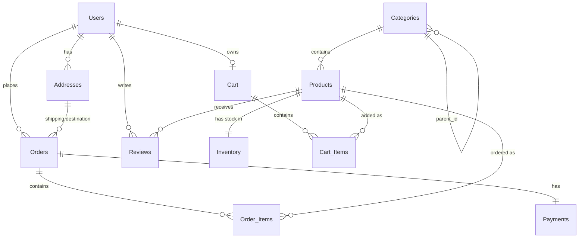

# ShopDB Database Schema & ER Diagram

This document explains the structure and relationships of all tables in the `shopdb` MySQL database for the BharatBazzar E-commerce application.

## Entity Relationship Diagram

## Tables & Schemas

### 1. `Users`
Stores customer and admin account information.
- `user_id` (PK, INT AUTO_INCREMENT): Unique identifier.
- `name` (VARCHAR): Full name of the user.
- `email` (VARCHAR, UNIQUE): User's email address (used for login).
- `password` (VARCHAR): Bcrypt hashed password.
- `phone` (VARCHAR): Contact phone number.
- `role` (ENUM): e.g., 'customer', 'admin'. Default is 'customer'.
- `created_at` (TIMESTAMP): Account creation timestamp.

### 2. `Addresses`
Stores multiple shipping addresses per user.
- `address_id` (PK, INT AUTO_INCREMENT): Unique identifier.
- `user_id` (FK, INT): References `Users.user_id`.
- `label` (VARCHAR): e.g., 'Home', 'Studio'.
- `street` (VARCHAR): Street address.
- `city` (VARCHAR): City name.
- `state` (VARCHAR): State name.
- `zip` (VARCHAR): Postal code.
- `country` (VARCHAR): Country name (default 'India').
- `is_default` (BOOLEAN): Flag for the default shipping address.

### 3. `Categories`
Hierarchical product categories.
- `category_id` (PK, INT AUTO_INCREMENT): Unique identifier.
- `name` (VARCHAR): Category name.
- `description` (TEXT): Category description.
- `parent_id` (FK, INT NULL): Self-referencing FK to `Categories.category_id` for subcategories.

### 4. `Products`
Core product catalog.
- `product_id` (PK, INT AUTO_INCREMENT): Unique identifier.
- `category_id` (FK, INT): References `Categories.category_id`.
- `name` (VARCHAR): Product name.
- `description` (TEXT): Product description.
- `price` (DECIMAL): Current price.
- `image_url` (VARCHAR): URL to the product image.
- `brand` (VARCHAR): Brand name.
- `is_active` (BOOLEAN): Whether the product is active/listed.
- `created_at` (TIMESTAMP): When the product was added.

### 5. `Inventory`
Tracks stock levels (separated from `Products` for 3NF normalization).
- `product_id` (PK & FK, INT): References `Products.product_id`.
- `quantity` (INT): Number of items currently in stock.

### 6. `Cart`
Shopping cart for a user (One active cart per user).
- `cart_id` (PK, INT AUTO_INCREMENT): Unique identifier.
- `user_id` (FK, INT UNIQUE): References `Users.user_id`.

### 7. `Cart_Items`
Line items within a shopping cart.
- `cart_item_id` (PK, INT AUTO_INCREMENT): Unique identifier.
- `cart_id` (FK, INT): References `Cart.cart_id`.
- `product_id` (FK, INT): References `Products.product_id`.
- `quantity` (INT): Quantity of the product.

### 8. `Orders`
Placed orders with a snapshot of price/discount at purchase time.
- `order_id` (PK, INT AUTO_INCREMENT): Unique identifier.
- `user_id` (FK, INT): References `Users.user_id`.
- `address_id` (FK, INT): References `Addresses.address_id`.
- `status` (ENUM): e.g., 'pending', 'confirmed', 'shipped', 'delivered'.
- `subtotal` (DECIMAL): Total before discounts.
- `discount` (DECIMAL): Discount amount applied.
- `total_amount` (DECIMAL): Final amount after discounts.
- `created_at` (TIMESTAMP): Order placement timestamp.

### 9. `Order_Items`
Line items within a placed order (price snapshot).
- `order_id` (PK & FK, INT): References `Orders.order_id`.
- `product_id` (PK & FK, INT): References `Products.product_id`.
- `quantity` (INT): Number of items ordered.
- `unit_price` (DECIMAL): Price of a single item at the time of purchase.

### 10. `Payments`
Payment methods and transaction references.
- `payment_id` (PK, INT AUTO_INCREMENT): Unique identifier.
- `order_id` (FK, INT UNIQUE): References `Orders.order_id`.
- `method` (VARCHAR): e.g., 'upi', 'card'.
- `status` (ENUM): e.g., 'pending', 'completed', 'failed'.
- `transaction_ref` (VARCHAR): Provider transaction reference.
- `provider` (VARCHAR): Payment provider name.
- `paid_at` (TIMESTAMP): Payment timestamp.

### 11. `Reviews`
Product reviews left by users.
- `review_id` (PK, INT AUTO_INCREMENT): Unique identifier.
- `product_id` (FK, INT): References `Products.product_id`.
- `user_id` (FK, INT): References `Users.user_id`.
- `rating` (INT): Rating 1-5.
- `title` (VARCHAR): Review title.
- `body` (TEXT): Review detailed body.
- `created_at` (TIMESTAMP): Review timestamp.

### 12. `Coupons`
Discount codes.
- `coupon_id` (PK, INT AUTO_INCREMENT): Unique identifier.
- `code` (VARCHAR, UNIQUE): the code itself.
- `discount_type` (ENUM): 'percent' or 'flat'.
- `discount_value` (DECIMAL): The value of the discount.
- `min_order_amt` (DECIMAL): Minimum order amount to apply.
- `max_uses` (INT): Maximum times it can be used overall.
- `is_active` (BOOLEAN): Status.

## Summary of Relationships

- **1 to Many (1:N)**: 
  - `Users` -> `Addresses`, `Orders`, `Reviews`
  - `Categories` -> `Products`, `Categories` (Parent to Child)
  - `Cart` -> `Cart_Items`
  - `Orders` -> `Order_Items`
  - `Products` -> `Reviews`, `Cart_Items`, `Order_Items`
  - `Addresses` -> `Orders`

- **1 to 1 (1:1)**:
  - `Users` -> `Cart`
  - `Products` -> `Inventory`
  - `Orders` -> `Payments`

- **Many to Many (M:N) Resolved**:
  - `Cart_Items` resolves the M:N between `Cart` and `Products`.
  - `Order_Items` resolves the M:N between `Orders` and `Products`.
